# Linux Commands Deep Dive

Now that I have a client terminal and have accessed the remote server, let's explore some Linux commands in detail.

# What Is a Linux Command?
A Linux command is a program or utility that can be executed in the terminal to perform a specific task. Commands can range from simple tasks like listing files to complex operations like managing system processes. A Linux command refers to a program or utility that runs in the command line interface (CLI) of a Linux operating system. These commands are used to perform various tasks such as file manipulation, system monitoring, and process management.

The general syntax of a Linux command is:
```
command [options] [arguments]
```
A command may consist of options and parameters. Options modify the behavior of the command, while parameters specify the target of the command.

**Command Name**: The name of the command to be executed. For example, if you wish to list files in a folder, you would use the `ls` command.

**Options or Flags**: Flags that modify the behavior of the command, usually prefixed with a dash (-) or double dash (--). For example, `ls -l` lists files in long format.

**Parameters or Arguments**: A parameter provides specific information or data required by the command. For example, `ls /home/user` lists files in the `/home/user` directory, and the `mkdir` command creates a new directory. For example, `mkdir photos` will create a **photos** directory.

It's important to note that Linux commands are case-sensitive, meaning `ls` and `LS` would be treated as different commands.

# Manipulating Files and Directories on Linux
Linux provides a rich set of commands for manipulating files and directories. Hence, it's essential to understand how to navigate the file system, create and delete files, and manage directories. Understanding different commands that cover various aspects of file and directory manipulation is important.

## The `sudo` Command

In Linux, the `sudo` command allows a permitted user to execute a command as the superuser or root user, as specified by the security policy. It stands for "superuser do" and is commonly used to perform administrative tasks that require elevated privileges.

**Why Use `sudo`?**
Using `sudo` is essential for performing tasks that require higher privileges than those granted to a regular user.

- **Security:** The `sudo` command helps maintain system security by allowing users to perform administrative tasks without logging in as the root user, which can be risky.
- **Tracking:** It logs all commands run with `sudo`, providing an audit trail of administrative actions.

**How `sudo` Works:**
When you run a command with `sudo`, the system checks if your user account is in the `sudoers` file, which defines who can run what commands as root. If you are authorized, you will be prompted to enter your password. After entering the correct password, the command will execute with elevated privileges.

**Creating a Folder with `sudo`:**
Sometimes, you may need to create a folder in a directory that requires root permissions. For example, creating a folder in `/usr/local/` might require `sudo`. Here's how you can do it:

1. Open your terminal and connect to your Linux server using SSH.

Connected to my AWS EC2 instance using SSH, I can now run commands on the remote server.
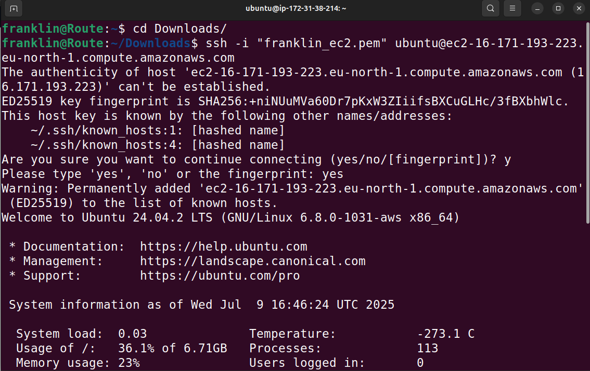

2. Try creating a folder in a restricted location. For example, creating a folder in the `/root/` directory, which typically requires root privileges.

```
sudo mkdir /root/example_folder
```
Encountered a permission error because the `/root/` directory is restricted to the root user.
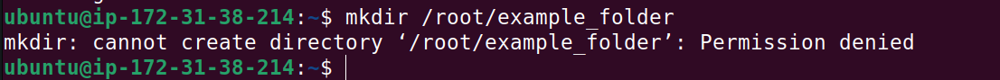

Let's use `sudo` to create the folder with elevated privileges:

```
sudo mkdir /root/example_folder
```
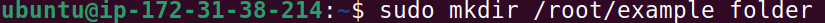

**Verifying the Folder Creation:**
To verify that the folder was created successfully, you can list the contents of the `/root/` directory using the `ls` command:
```
sudo ls /root/
```
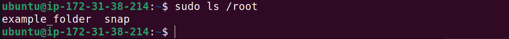

**Note:** Using `sudo` gives you significant power over your system, so it's important to use it carefully. Always ensure you understand the command you are running with `sudo` to avoid unintended changes or damage to your system.

Use the `pwd` command to print the current working directory, which shows where you are in the file system. This is useful to confirm your location before creating or manipulating files and directories.

The `pwd` command uses the following syntax:

```bash
pwd
```
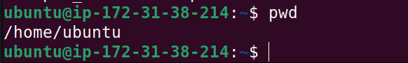

The Linux directory structure is hierarchical, starting from the root directory (`/`).

## The Root Directory (`/`):
At the top of the hierarchy is the root directory, represented by a single forward slash (`/`). Unlike Windows, which uses different drives (`C:`, `D:`, etc.), Linux organizes everything starting from this root directory. Under `/`, you'll find various directories with specific purposes:

- `/bin`: Contains essential user commands and binaries that are required for system booting and basic operations.
- `/etc`: Contains configuration files for the system and applications. This is where you can find system-wide settings and configurations.
- `/home`: Contains user home directories, where personal files and settings are stored for each user. For example, `/home/username` is the home directory for a user named "username".
- `/var`: Contains variable data files such as logs, databases, and spool files. This directory is used for files that are expected to change frequently.
- `/usr`: Contains user-related programs and data, including applications and libraries. It is further divided into subdirectories like `/usr/bin` for user commands and `/usr/lib` for libraries.

Using `ls` to explore some root directories:
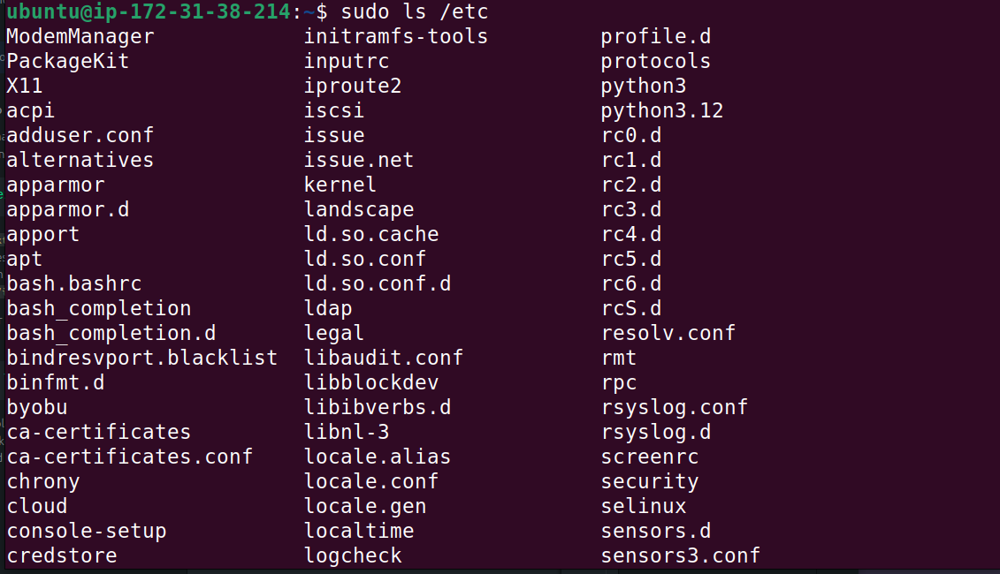
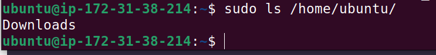
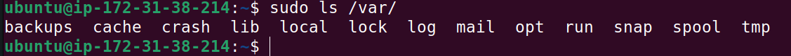

## `cd` Command

The `cd` command, short for "change directory," is used to navigate between directories in the Linux file system. It allows you to move from your current directory to another directory, making it essential for file management and navigation.
To go to the root directory, simply type:
```bash
cd /
```
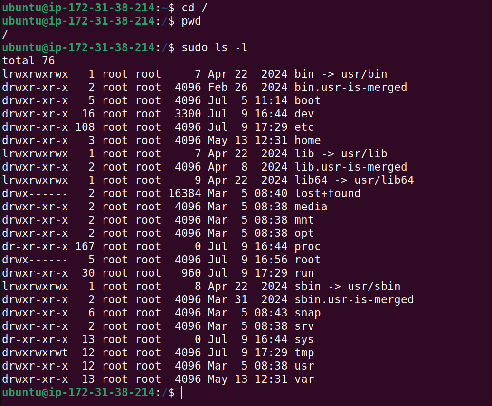

If you want to navigate to a specific directory, you can use the `cd` command followed by the path of the directory. For example, to navigate to the `/etc` directory, you would type:
```bash
cd /etc
```
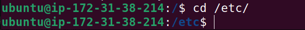

**Note:** The `etc` has a `/` prefix. On Linux, navigation starts from the root directory, which is represented by a single forward slash (`/`). This means that when you specify a path like `/etc`, it refers to the `etc` directory located directly under the root directory. If you were to use `cd etc` without the leading slash, it would look for an `etc` directory in your current working directory, which may not exist.

## Side Hustle Task 1:
- Create a directory named `photos` inside the `/usr` directory.
  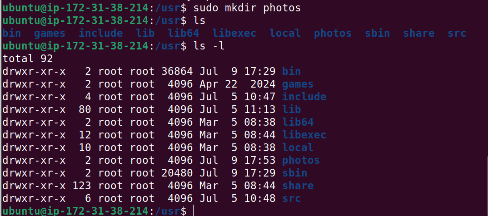
- Navigate to the `photos` directory using the `cd` command.
  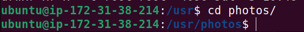
- Create 3 folders inside the `photos` directory named `folder1`, `folder2`, and `folder3`.
  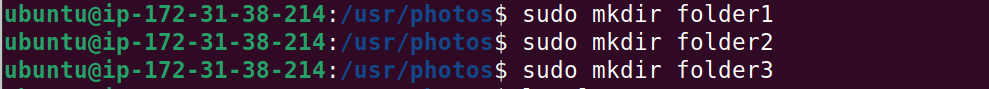
- Show the newly created folders in your terminal.
  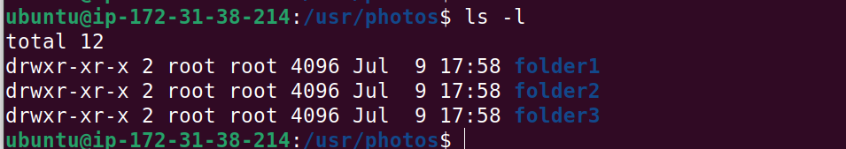
- Navigate into one of the folders.
  
- Show the full path where you currently are on the screen.
  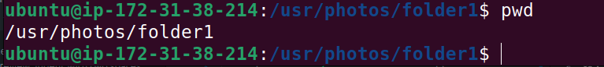

## `ls` Command
The `ls` command is used to list the contents of a directory. It displays files and directories within the specified directory or the current directory if no path is provided. The `ls` command is a fundamental command in Linux for viewing the contents of directories. Running the `ls` command without a flag or parameter will list the files and directories in the current working directory.
```bash
ls
```
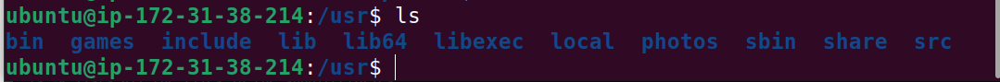

To see other directories, type `ls` followed by the path of the directory you want to list. For example, to list the contents of the `/etc` directory, you would type:
```bash
ls /etc
```


Trying some `ls` commands:
```bash
ls -R
```
This command lists all files and directories recursively, showing the contents of subdirectories as well.
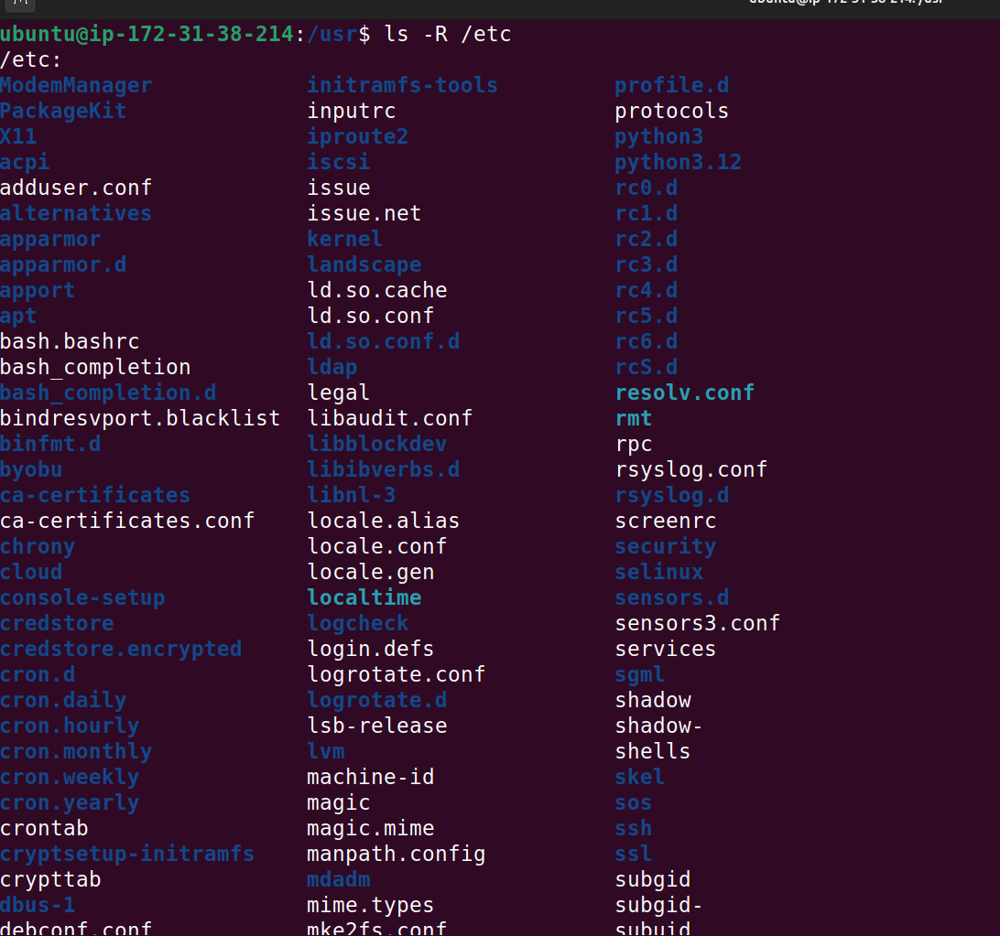

```bash
ls -l
```
This command lists files and directories in long format, providing detailed information such as permissions, ownership, size, and modification date.
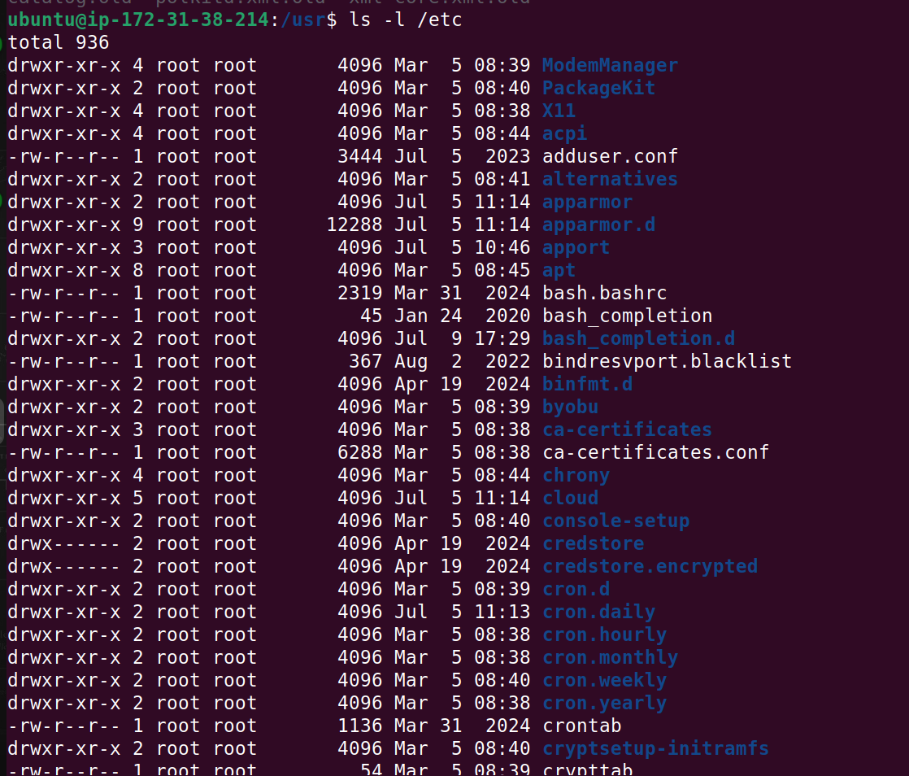

```bash
ls -a
```
This command lists all files and directories, including hidden ones (those starting with a dot `.`).
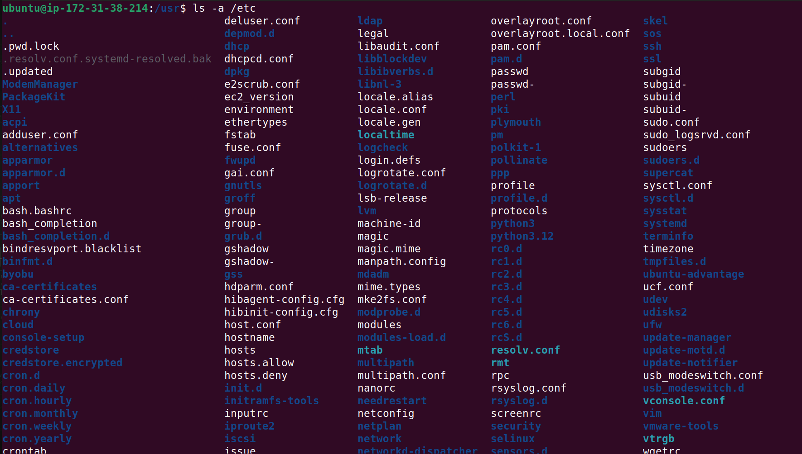

```bash
ls -lh
```
This command lists files and directories in long format with human-readable file sizes (e.g., KB, MB).
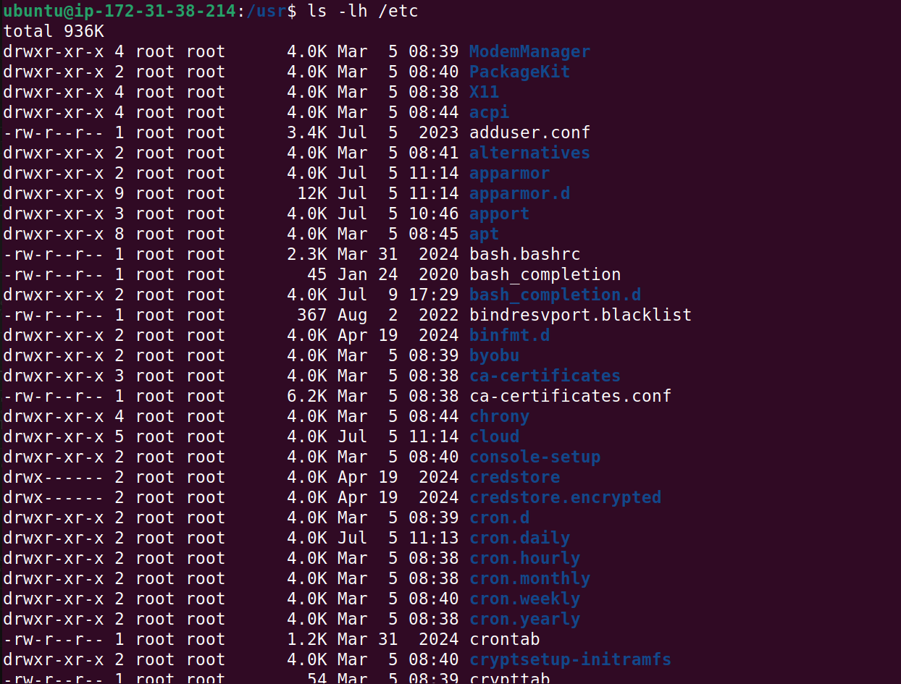

## `cat` Command
The `cat` command is used to concatenate and display the contents of files in the terminal. It can also be used to create new files or append content to existing files. The `cat` command is a versatile tool for viewing and manipulating text files in Linux. It can be used to display the contents of a file, create new files, or concatenate multiple files into one.
```bash
cat filename.txt
```
This command displays the contents of the specified file (`filename.txt`) in the terminal.
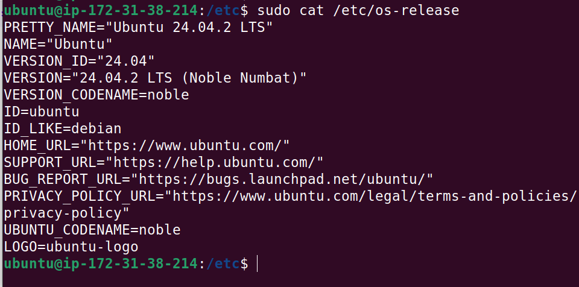

## `cp` Command
The `cp` command is used to copy files and directories from one location to another. It allows you to duplicate files or move them to a different directory while preserving the original file.

The `cp` command is a fundamental command in Linux for copying files and directories. It allows you to create duplicates of files or move them to different locations while preserving the original file.
```bash
cp source_file destination_file
```
To copy multiple files, you can use the `cp` command followed by the source files and the destination directory. For example, to copy `file1.txt` and `file2.txt` to the `/home/user/documents/` directory, you would type:
```bash
cp file1.txt file2.txt /home/user/documents/
```
To copy a directory and its contents, you can use the `-r` (recursive) option with the `cp` command. For example, to copy a directory named `my_folder` and all its contents to the `/home/user/documents/` directory, you would type:
```bash
cp -r my_folder /home/user/documents/
```

## `mv` Command
The `mv` command is used to move or rename files and directories in Linux. It allows you to change the location of a file or directory or rename it without creating a copy.

The `mv` command is a fundamental command in Linux for moving or renaming files and directories. It allows you to change the location of a file or directory or rename it without creating a copy.
```bash
mv source_file destination_file
```
To move a file to a different directory, you can use the `mv` command followed by the source file and the destination directory. For example, to move `file1.txt` to the `/home/user/documents/` directory, you would type:
```bash
mv file1.txt /home/user/documents/
```
To rename a file, you can use the `mv` command followed by the current file name and the new file name. For example, to rename `file1.txt` to `new_file.txt`, you would type:
```bash
mv file1.txt new_file.txt
```

## `rm` Command
The `rm` command is used to remove (delete) files and directories in Linux. It allows you to permanently delete files or directories from the file system. The `rm` command is a fundamental command in Linux for removing files and directories. It allows you to permanently delete files or directories from the file system.
```bash
rm filename.txt
```
To remove a file, you can use the `rm` command followed by the file name. For example, to remove `file1.txt`, you would type:
```bash
rm file1.txt
```
To remove multiple files, you can specify them one after another. For example, to remove `file1.txt` and `file2.txt`, you would type:
```bash
rm file1.txt file2.txt
```
Here are some options you can use with the `rm` command:
- `-r`: This option allows you to remove directories and their contents recursively. For example, to remove a directory named `my_folder` and all its contents, you would type:
```bash
rm -r my_folder
```
- `-f`: This option forces the removal of files without prompting for confirmation. It is useful when you want to delete files without being asked for confirmation. For example:
```bash
rm -f file1.txt
```
- `-i`: This option prompts for confirmation before removing each file. It is useful when you want to be cautious about deleting files. For example:
```bash
rm -i file1.txt
```
- `-v`: This option provides verbose output, showing which files are being removed. It is useful for tracking the progress of the removal operation. For example:
```bash
rm -v file1.txt
```

## `touch` Command
The `touch` command is used to create an empty file or update the timestamp of an existing file in Linux. It allows you to create new files quickly without opening a text editor.

The `touch` command is a fundamental command in Linux for creating empty files or updating the timestamp of existing files. It allows you to create new files quickly without opening a text editor.
```bash
touch filename.txt
```
To create an empty file, you can use the `touch` command followed by the desired file name. For example, to create an empty file named `new_file.txt`, you would type:
```bash
touch new_file.txt
```
To create multiple empty files at once, you can specify the file names one after another. For example, to create `file1.txt`, `file2.txt`, and `file3.txt`, you would type:
```bash
touch file1.txt file2.txt file3.txt
```
To update the timestamp of an existing file, you can use the `touch` command followed by the file name. For example, to update the timestamp of `file1.txt`, you would type:
```bash
touch file1.txt
```

## `find` Command
The `find` command is used to search for files and directories in a specified location based on various criteria. It allows you to locate files and directories based on their names, types, sizes, modification times, and more. The `find` command is a powerful tool for searching files and directories in Linux. It allows you to locate files and directories based on various criteria, such as name, type, size, and modification time.
```bash
find [path] [options] [expression]
```
To search for a file by name, you can use the `find` command followed by the path where you want to search and the `-name` option. For example, to search for a file named `example.txt` in the current directory and its subdirectories, you would type:
```bash
find . -name "example.txt"
```
To search for files by type, you can use the `-type` option. For example, to search for all directories in the current directory and its subdirectories, you would type:
```bash
find . -type d
```
To search for files by size, you can use the `-size` option. For example, to search for files larger than 1 MB in the current directory and its subdirectories, you would type:
```bash
find . -size +1M
```
To search for files modified within the last 7 days, you can use the `-mtime` option. For example, to search for files modified in the last 7 days in the current directory, you would type:
```bash
find . -mtime -7
```


